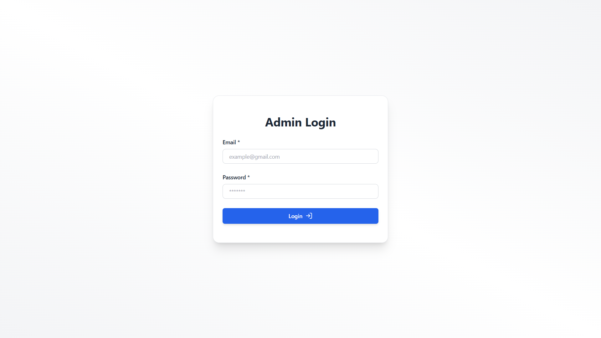
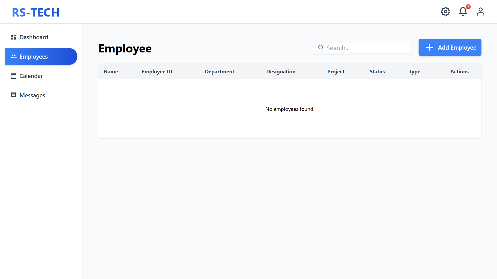
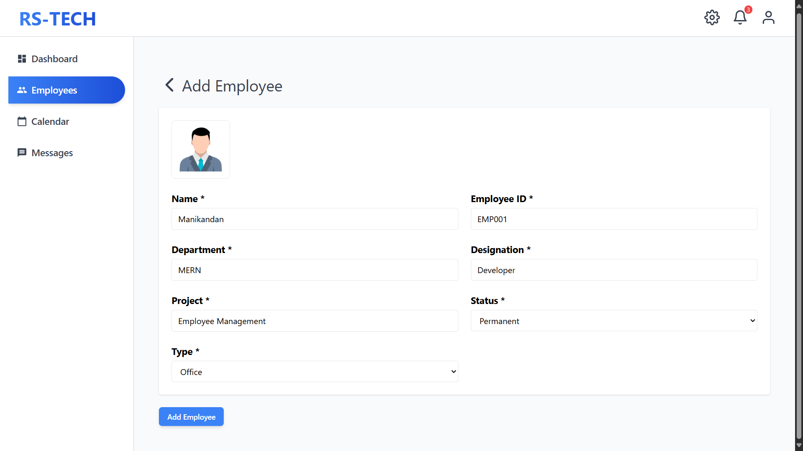
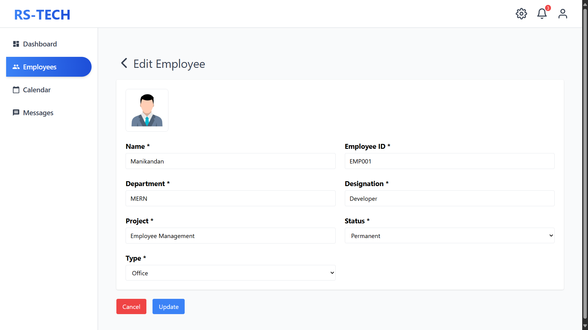
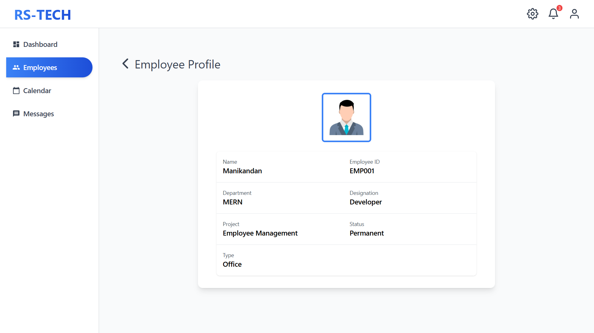
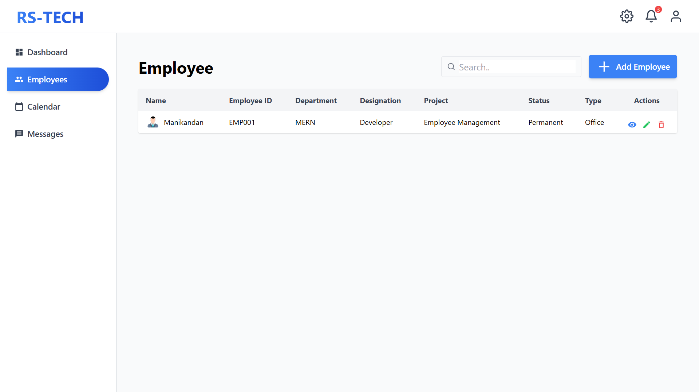

# Employee Management System (RS TECH)

A simple and responsive Employee Management System built with the MySQL, Express.js, React.js, and Node.js stack.
This system allows users to add, edit, update, delete, and manage employee records with a clean UI and modern design, while storing data securely in a MySQL relational database.

---

## Tech Stack

**Frontend**  
- React.js  
- Tailwind CSS  
- React Icons  

**Backend**  
- Node.js  
- Express.js  

**Database**  
- MySQL (sequelize ) 

**Other Libraries**  
- `react-icons` → Icons  
- `react-calendar` → Calendar inputs  
- `react-hot-toast` → Notifications  
- `cors` → Cross-origin requests  
- `body-parser` → Parsing requests
- `mysql2` → Node.js and MySQL databases
- `sequelize ` → Node.js ORM

---

## Installation

1. **Clone the repository**
   ```bash
   git clone <repository-url>
   cd RS-Employee-Management

2. **Install dependencies for both backend and frontend**
###### Install backend dependencies
    cd backend && npm install

###### Install frontend dependencies

    cd ../frontend && npm install

3. **Run MySQL**
Create database in MySQL
   ```
   CREATE DATABASE rs_tech;

4. **Run the development servers**

###### Start backend server (from backend directory)
    cd backend 
    npm run dev

###### Start frontend server (from frontend directory in new terminal)
    cd frontend
    npm start

## Login Credentials

    Email: admin123@gmail.com
    Password: admin123

## Additional Dependencies

If you face errors while running the project, make sure to install these extra packages:

    npm install react-router-dom 
    react-calendar 
    react-icons 
    react-hot-toast
    tailwindcss@3

These are used for routing, calendar inputs, icons, and toast notifications. still getting error make uploades folder in backend directory.

##Screenshots
<br/> <br/>

<br/><br/>

<br/><br/>

<br/><br/>

<br/><br/>

<br/><br/>

<br/><br/>

<br/><br/>

   
   
